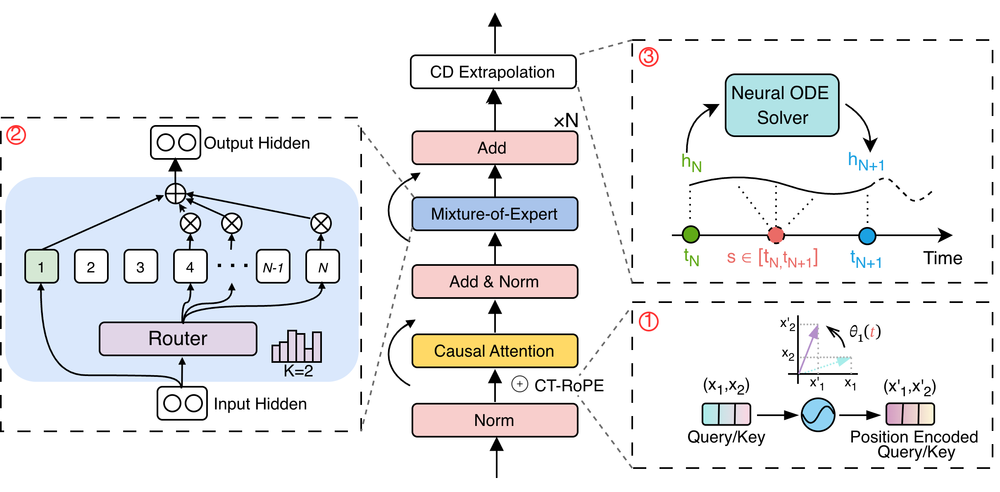

<div align="center">
  <h2><b>(NeurIPS '25) MIRA: Medical Time Series Foundation Model for Real-World Health Data </b></h2>
</div>

<div align="center">

**[<a href="https://arxiv.org/abs/2506.07584">Paper Page</a>]**

</div>

## Overview

MIRA is a foundation model for medical time-series, designed to learn a unified representation space across heterogeneous clinical datasets and support zero-shot forecasting in real-world healthcare settings. Unlike conventional time-series models that operate on fixed sampling rates or task-specific feature spaces, MIRA is built to handle irregular, multimodal, and clinically diverse signals natively. By combining continuous-time encoding, frequency-aware specialization, and neural dynamics modeling, MIRA generalizes robustly across conditions.

**Key features**
- Continuous-Time Rotary Positional Encoding (CT-RoPE)
Provides a principled way to embed irregular timestamps while preserving temporal geometry, enabling robust reasoning across arbitrary sampling patterns.
- Frequency-specialized Mixture-of-Experts
Allows different experts to specialize on physiological signs, improving transfer across diverse clinical signals.
- Neural ODE Extrapolation
Models latent dynamics continuously over time, enabling forecasting at arbitrary future timestamps.

<p align="center">
  
</p>

---

## Installation

Install Python 3.10+, and then install the dependencies:

```shell
pip install -r requirements.txt
pip install torchdiffeq
```

**Note: MIRA requires `transformers==4.40.1` .**

---
## Data Preparation

### Data format example

Each line represents one sample and must contain at least `sequence` and
`time` fields:

``` json
{"sequence": [1.0, 1.2, 0.8, ...], "time": [0.12, 1.52, 2.31, ...], "mask": [1,1,1,...]}
{"sequence": [5.1, 5.0, 5.3, ...], "time": [1699990000, 1699990600, 1699991200, ...], "mask": [1,1,1,...]}
```
---
## Training

MIRA can be trained on either CPU or GPU environments. The training script automatically handles model initialization, dataset loading, and checkpointing. Below we provide example commands for common setups. For training on irregular medical data:

```bash
python torch_dist_run.py main.py \
  --from_scratch \
  -d ./yourdata.jsonl \
  --output_path ./saveyoucheckpoints \
  --save_steps 10000 \
  --save_strategy steps \
  --save_total_limit 10 \
  --save_only_model \
  --precision bf16 \
  --time_aware_dataset \
  --time_aware_rotary
```

### CPU

If you prefer to train on CPU, simply point the script to your dataset directory:
```bash
python main.py -d <data_path>
```

### GPU
The project includes a lightweight launcher that wraps PyTorch distributed training. On a machine with one or multiple GPUs, launch training via:
```bash
python torch_dist_run.py main.py -d <data_path>
```

For multi-node setups, standard PyTorch elastic variables must be configured.

```bash
export MASTER_ADDR=<master_addr>
export MASTER_PORT=<master_port>
export WORLD_SIZE=<world_size>
export RANK=<rank>
python torch_dist_run.py main.py -d <data_path>
```

To training from scratch, please include the --from_scratch argument in your command. 

```bash
python torch_dist_run.py main.py -d <data_path> --from_scratch
```

For full argument list:

```bash
python main.py --help
```


## Inference

```bash
import torch
from MIRA.mira.models.modeling_mira import MIRAForPrediction
from MIRA.mira.models.utils_time_normalization import normalize_time_for_ctrope

seq  = torch.tensor([[...]], dtype=torch.float32)      
time = torch.tensor([[...]], dtype=torch.float32)     

C = 12   # history length
P = 6    # forecast horizon
T = seq.shape[1]

attn = torch.ones_like(time)

full_scaled_times, t_min, t_max = normalize_time_for_ctrope(
    time_values=time,
    attention_mask=attn,
    seq_length=T,
    alpha=1.0,
)

hist_times   = full_scaled_times[:, :C]
future_times = full_scaled_times[:, C:C+P]

mean = seq.mean(dim=1, keepdim=True)
std  = seq.std(dim=1, keepdim=True) + 1e-6

seq_norm  = (seq - mean) / std
hist_vals = seq_norm[:, :C]

ckpt_path = "/checkpoint"
model = MIRAForPrediction.from_pretrained(ckpt_path).cuda()
model.eval()

device = next(model.parameters()).device
hist_vals    = hist_vals.to(device)
hist_times   = hist_times.to(device)
future_times = future_times.to(device)

cur_vals  = hist_vals.clone()
cur_times = hist_times.clone()

preds_norm = []

for i in range(P):

    # model input
    inp_vals  = cur_vals.unsqueeze(-1)   # [1, L, 1]
    inp_times = cur_times                # [1, L]

    with torch.no_grad():
        out = model(
            input_ids=inp_vals,
            time_values=inp_times,
            next_target_time_values=None,  # no ODE for 1-step
            return_dict=True,
        )

    next_norm = out.logits[:, -1, :]     # [1, 1]
    preds_norm.append(next_norm.squeeze(0))

    next_t = future_times[:, i:i+1]

    cur_vals  = torch.cat([cur_vals, next_norm], dim=1)
    cur_times = torch.cat([cur_times, next_t], dim=1)


preds_norm = torch.stack(preds_norm, dim=1)   # [1, P]

preds = preds_norm * std[:, :, :] + mean[:, :, :]
preds = preds.squeeze(0)
print(preds)
```

## Datasets

> **Note:** All datasets used in this project are clinical or physiological time-series datasets. Because these datasets contain sensitive human subject information, they are governed by strict data-use agreements (DUA) and protected access policies. Therefore, the raw datasets cannot be redistributed in this repository. You must apply for access through the official data providers listed below.

- **MIMIC** — 
Access link: https://physionet.org/content/mimiciv/
- **WAVES Pediatric Waveform Database** — 
Access link: https://redivis.com/WAVES/datasets
- **PTB-XL** — 
Access link: https://physionet.org/content/ptb-xl/1.0.3/
- **Sleep-EDF** — 
Access link: https://physionet.org/content/sleep-edfx/1.0.0/


## Citation

> Please let us know if you find out a mistake or have any suggestions!

> If you find the MIRA models helpful in your research, please consider to star this repository and cite the
> corresponding [paper](https://arxiv.org/abs/2506.07584):

```
@article{li2025mira,
  title={MIRA: Medical Time Series Foundation Model for Real-World Health Data},
  author={Li, Hao and Deng, Bowen and Xu, Chang and Feng, Zhiyuan and Schlegel, Viktor and Huang, Yu-Hao and Sun, Yizheng and Sun, Jingyuan and Yang, Kailai and Yu, Yiyao and others},
  journal={arXiv preprint arXiv:2506.07584},
  year={2025}
}
```


## Acknowledgement

We appreciate the following GitHub repos a lot for their valuable code and efforts.

- Time-MoE [\[repo\]](https://github.com/Time-MoE/Time-MoE)
- Time-LLM [\[repo\]](https://github.com/KimMeen/Time-LLM)
- TimeMixer [\[repo\]](https://github.com/kwuking/TimeMixer)
- Time-Series-Library [\[repo\]](https://github.com/thuml/Time-Series-Library)
- Large (Language) Models and Foundation Models (LLM, LM, FM) for Time Series and Spatio-Temporal
  Data [\[repo\]](https://github.com/qingsongedu/Awesome-TimeSeries-SpatioTemporal-LM-LLM)

## License

This project is licensed under the MIT License.

